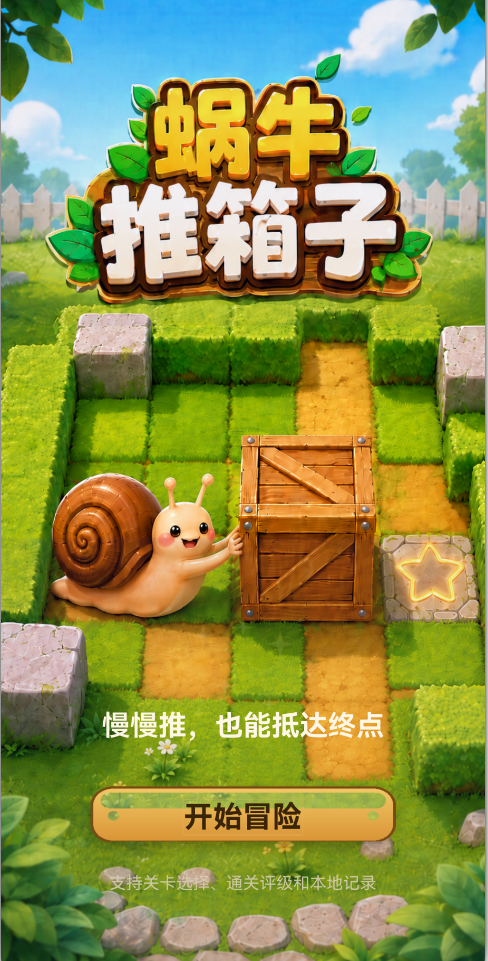
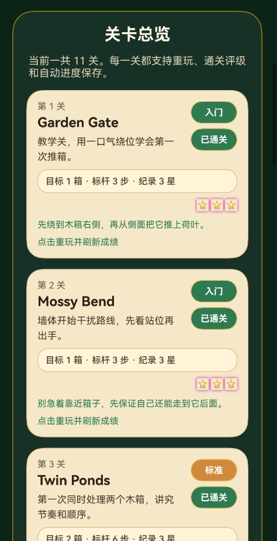
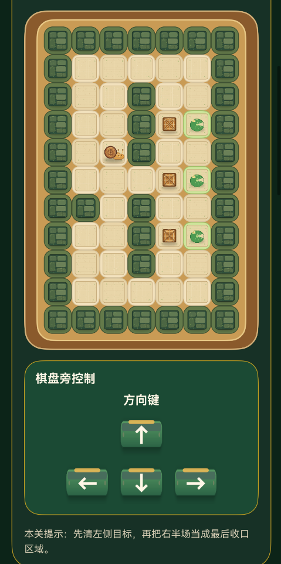
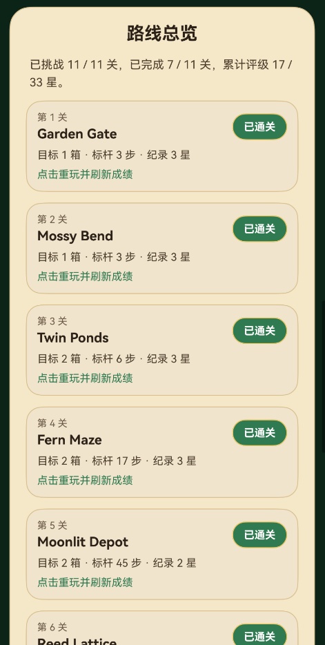
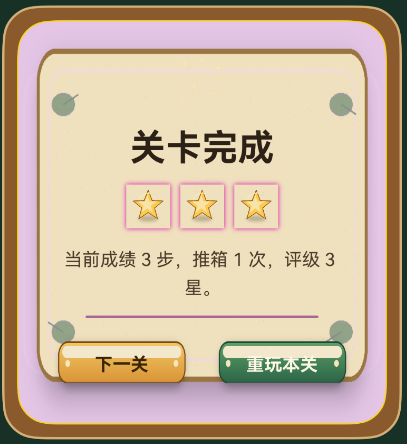
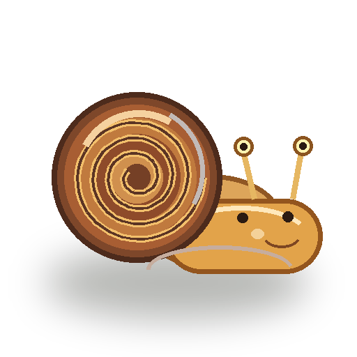
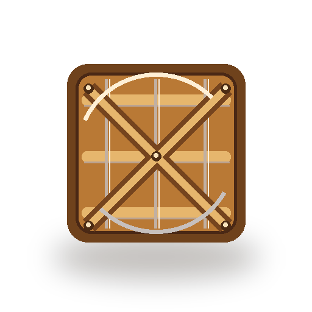
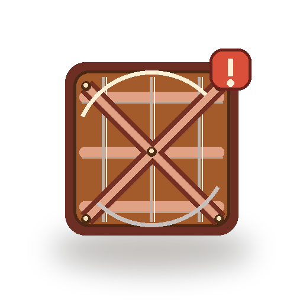
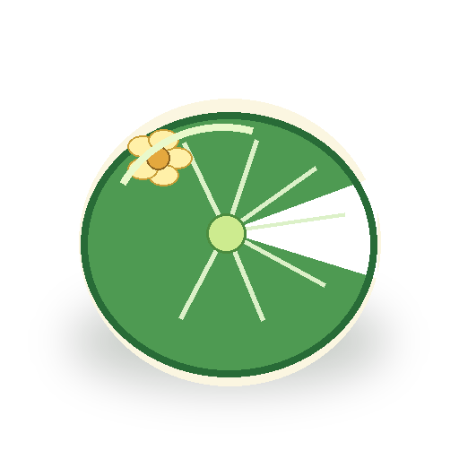

# 蜗牛推箱子

蜗牛推箱子是一款基于 HarmonyOS / ArkTS 开发的关卡制 Sokoban 益智小游戏。玩家控制蜗牛在森林棋盘中移动，将所有木箱推到荷叶目标点，完成关卡挑战并获得星级评价。

游戏包含开始页、关卡总览、局内控制、路线总览、通关动画、本地挑战记录、背景音乐、开始页音乐和通关音效，形成完整的移动端小游戏流程。

## 游戏截图

### 开始页面



### 关卡总览



### 棋盘与局内控制



### 路线总览



### 通关反馈



## 核心功能

- 11 个手工设计关卡，难度从入门到挑战逐步提升。
- 所有关卡初始可直接选择，无需解锁。
- 支持屏幕方向键、键盘方向键和 `W`、`A`、`S`、`D` 操作。
- 支持撤销、重开、上一关、下一关和返回总览。
- 自动保存最近游玩关卡、挑战次数、最佳步数、最佳推箱次数和最高星级。
- 通关后展示完成面板、星级评价和下一关入口。
- 播放通关音效时暂停背景音乐，音效结束后恢复背景音乐。
- 长地图支持竖版关卡布局，避免棋盘超出可视范围。
- 棋盘元素使用蜗牛、木箱、荷叶、森林地面和苔藓墙体素材渲染。

## 玩法规则

玩家每次移动一格。当前方是木箱时，如果木箱后方是可行走地块，蜗牛会推动木箱前进一格；如果后方是墙体、空洞或其他木箱，本次移动会被阻止。

通关条件为所有木箱都位于荷叶目标点上。游戏根据关卡标杆步数计算星级，并保存每一关的最佳成绩。

## 操作方式

| 操作 | 说明 |
| --- | --- |
| 屏幕方向键 | 点击 `↑`、`←`、`↓`、`→` 移动蜗牛 |
| 键盘方向键 | 使用物理键盘方向键移动 |
| WASD | 使用 `W`、`A`、`S`、`D` 移动 |
| 撤销 | 回退上一步 |
| 重开 | 重置当前关卡 |
| 上一关 / 下一关 | 切换关卡 |
| 返回总览 | 回到首页选择关卡 |

## 关卡列表

| 关卡 | 名称 | 难度 | 标杆步数 | 设计重点 |
| --- | --- | --- | --- | --- |
| 1 | Garden Gate | 入门 | 3 | 学习基础推箱和绕位 |
| 2 | Mossy Bend | 入门 | 3 | 观察墙体对站位的影响 |
| 3 | Twin Ponds | 标准 | 6 | 同时处理两个木箱 |
| 4 | Fern Maze | 标准 | 17 | 判断中段墙体切分后的路线顺序 |
| 5 | Moonlit Depot | 挑战 | 45 | 开阔空间中的连续调整 |
| 6 | Reed Lattice | 挑战 | 47 | 三箱规划和竖版地图 |
| 7 | Lily Vault | 挑战 | 51 | 避免中央箱位堵住两侧通道 |
| 8 | Cattail Switchyard | 挑战 | 51 | 处理上下动线互相干扰 |
| 9 | Pebble Weir | 挑战 | 53 | 在中路限制下完成回身 |
| 10 | Drift Gallery | 挑战 | 56 | 利用门洞完成换位 |
| 11 | Harbor of Shells | 挑战 | 57 | 综合考验内外墙体和回旋空间 |

## 技术实现

### 页面与流程

`entry/src/main/ets/pages/Index.ets` 负责主要页面和运行流程，包括开始页、首页、游玩页、棋盘渲染、局内控制、路线总览、通关弹层、音频播放和存档读写。

### 关卡数据

`entry/src/main/ets/data/SnailLevels.ets` 定义关卡地图、标题、副标题、难度、提示、标杆步数和地图方向。

地图字符含义：

| 字符 | 含义 |
| --- | --- |
| `#` | 墙体 |
| 空格 | 普通地面 |
| `.` | 荷叶目标点 |
| `$` | 木箱 |
| `@` | 蜗牛初始位置 |
| `*` | 位于目标点上的木箱 |
| `+` | 位于目标点上的蜗牛 |

### 推箱逻辑

`entry/src/main/ets/utils/SokobanLogic.ets` 负责地图解析、坐标编码、移动判定、推箱判定、通关检测、撤销快照和死角检测。

### 键盘映射

`entry/src/main/ets/utils/KeyboardMapping.ets` 支持 OpenHarmony 方向键 keyCode，并兼容 `WASD` 文本键位。

### 视觉主题

`entry/src/main/ets/theme/VisualTheme.ets` 集中管理颜色、字号、圆角、间距和阴影常量，保证首页、局内页、按钮、关卡卡片和通关弹层风格统一。

### 音频资源

| 资源 | 路径 |
| --- | --- |
| 开始页音乐 | `entry/src/main/resources/rawfile/开始页面音乐.mp3` |
| 游戏背景音乐 | `entry/src/main/resources/rawfile/背景音乐.mp3` |
| 通关音效 | `entry/src/main/resources/rawfile/通关音效.mp3` |

## 美术资源

| 素材 | 预览 | 用途 |
| --- | --- | --- |
| 蜗牛角色 |  | 玩家角色 |
| 普通木箱 |  | 推箱目标 |
| 死角木箱 |  | 死角预警 |
| 荷叶目标 |  | 箱子终点 |
| 金色星星 |  | 通关评级 |
| 主按钮 |  | 主要操作 |
| 绿色按钮 |  | 次级操作和方向键 |

## 项目结构

```text
entry/src/main/ets/
  data/
    SnailLevels.ets          关卡数据、难度、提示、标杆步数
  pages/
    Index.ets                主页面、游戏流程、UI、音频和存档
  theme/
    VisualTheme.ets          视觉主题常量
  utils/
    KeyboardMapping.ets      方向键和 WASD 映射
    SokobanLogic.ets         推箱规则、通关判定、死角检测
```

```text
entry/src/main/resources/
  base/media/
    start_page.png
    snail_player.png
    wood_box.png
    wood_box_deadlock.png
    lily_goal.png
    moss_wall_tile.png
    forest_floor_tile.png
    gold_star.png
    ui_button_primary.png
    ui_button_green.png
    card_panel_parchment.png
    start_page_decoration.png
    sparkles.png
  rawfile/
    开始页面音乐.mp3
    背景音乐.mp3
    通关音效.mp3
```

## 运行方式

1. 使用 DevEco Studio 打开项目根目录。
2. 确认 HarmonyOS SDK 与工程依赖完整。
3. 选择 `entry` 模块。
4. 连接模拟器或真机。
5. 点击运行，进入“蜗牛推箱子”开始页面。

## 构建验证

项目可通过 DevEco Studio / hvigor 构建 `entry` 模块。命令行环境可使用 `assembleApp` 进行完整打包验证。
